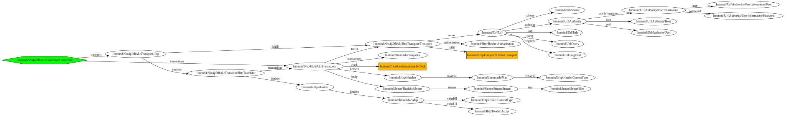

# neo4j-dbal

[](https://github.com/Innmind/neo4j-dbal/actions?query=workflow%3ACI)
[](https://codecov.io/gh/Innmind/neo4j-dbal)
[](https://shepherd.dev/github/Innmind/neo4j-dbal)


PHP abstraction layer for neo4j graph database

## Installation

Run the following command in your project to add this library:

```sh
composer require innmind/neo4j-dbal
```

## Documentation

Basic example to run a query:

```php
use function Innmind\Neo4j\DBAL\bootstrap;
use Innmind\Neo4j\DBAL\{
    Query,
    Clause\Expression\Relationship
};
use Innmind\OperatingSystem\Factory;

$os = Factory::build();
$connection = bootstrap(
    $os->remote()->http(),
    $os->clock(),
);

$query = (new Query)
    ->match('n', ['LabelA', 'LabelB'])
        ->withProperty('foo', '$param')
        ->withParameter('param', 'value')
    ->linkedTo('n2')
    ->through('r', 'REL_TYPE', 'right')
    ->return('n', 'n2', 'r');
echo $query->cypher(); //MATCH (n:LabelA:LabelB { foo: $param })-[r:REL_TYPE]->(n2) RETURN n, n2, r

$result = $connection->execute($query);
echo $result->nodes()->count(); //2
echo $result->relationships()->count(); //1
```

**Note**: Each object in this library is **immutable**, so `$query->match('n')->match('n2')` is different than `$query->match('n'); $query->match('n2')`.


### Querying

You have 3 options to execute a query:

* use [`Query`](src/Query/Query.php) to build the query via its API
* use [`Cypher`](src/Query/Cypher.php) where you put the raw cypher query
* create your own class that implements [`Query`](src/Query.php)

## Structure


